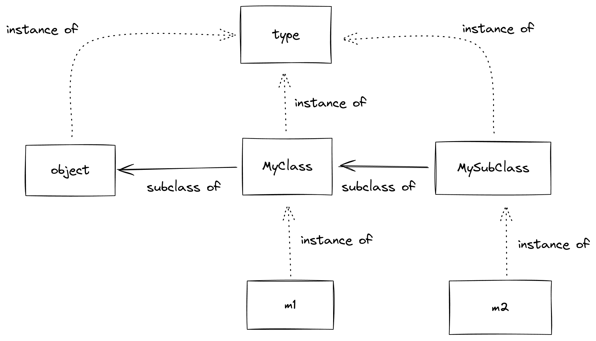

# Metaclasses

## What are they for?

## Where do they live?

## How do they reproduce?

Leonardo Rochael & Luciano Ramalho

22 April, 2024

Note:

Intro: 5 min.

Launch IPython in %doctest_mode

Launch x11vnc

Launch Remote Desktop Viewer, move it to the beamer display.

---


Note:

I have been working with Python for 21 years.

My first job with Python was having Luciano Ramalho as a boss.

And I had the honor of reviewing both the 1st and 2nd ed. of Fluent Python.

And I was a victim of the curse of knowledge.

* Teaching metaclasses is going to be easy
  * I realized I only have to teach a third of Luciano's book before I can do that...

---

## But first: two types of methods

* Normal methods:
  * How to declare: `def method(self):`
  * How to use: `object.method()`
* Special methods
  * How to declare: `def __str__(self):`
  * How to use: `print(object)`

Note:

A normal method is what you access with the little dot.

A special method is one that is usually accessed by Python
to do something special with an instance of your class.

---


Note:

Source: Fluent Python Second Edition

For example, these are all the special methods that your class can
implement, and they allow the class instance to participate in operations with
mathematical operators, plus, times, etc.

---


Note:

Source: Fluent Python Second Edition

These special methods are all the others that do not have to do with
participating in math operations.

There are special methods for your class to be called as if it were a function,
indexed as if it were a list or dictionary, provide a length with
`len()`, specify its representation on the console, etc.

---


Note:

[Source](https://excalidraw.com/#room=0604fda9fd149a1a9bee,MWy-2_D7UHMOLpjI1FBQkg)

Show `slides/code/slide0_methods.py`

```text
from slide0_methods import *

m1 = MyClass()

m2 = MySubClass()

m1.double()

m1.x = 7

m1.double()

m2.double()

m1

m2

def __call__(self, other):
    return self.x + other

MyClass.__call__ = __call__

m2(7)
```

---

## Resolution order: Normal Methods

(and normal attributes)

0. instance
1. class
2. superclasses

---

## Resolution order: Special Methods

("dunder" methods: `__...__`)

0. ~~instance~~ **NO**!
1. class
2. superclasses

---

## Every time is *Runtime*

In Python, function and class declarations "happen" at
**runtime**.

Note:

Classes are created at runtime,

But imports only "run" the module once.

Demonstrate with prints all around:

* `slides/code/slide1_runtime.py`

---

## Everything is an Object (1)


<font size="1">
Image © Luciano Ramalho, used with permission
</font>

Classes are values too!

Note:

In Python, all declared things are assigned to variables, including
functions and classes!

Classes (and functions) can be assigned to variables, lists, and dictionaries.

Demonstrate overriding the variables in which the classes were declared,
and instantiate the classes through the variables in which they were saved.

```text
a = [1, 2, 3]
b = a
b.append(4)
b
a
```

I can assign classes to other variables

```text
MyClass2 = MyClass

instance2 = MyClass2()

MyClass = None

instance = MyClass()
```

I can put classes in lists, or place them in dictionaries

By the way, the contents of imported modules is in a dictionary:

```text
slide1_runtime.__dict__.keys()

{key: value for key, value in slide1_runtime.__dict__.items() if not key.startswith('__')}
```

Classes and instances attributes too:

```python
m1.__dict__
MySubClass.__dict__
```

As my friend Lalo Martins would say:

> Python is made only of dictionaries and tons of syntactic sugar

---

## The Two Responsibilities of `class`

```python
class Duck:
    ...
```

* Generate a class
* Assign to the class a variable
  * With the same name as the class

Note:

`class` is not a "declaration". It is a "compound statement".

The same two responsibilities apply to `def` and functions.

What this means is that you can create classes inside functions.

And it is also possible to create functions inside functions.

---

## Everything is an Object (2)

All values have a class

* including classes!

Note:

Demonstrate `obj.__class__`, `type(obj)`, and `isinstance(obj, class)`

```text
duck.__class__
type(duck)

duck.__class__ is type(duck)

duck.__class__ is slide1_runtime.Duck

```

---

## Everything is an Object (3)

* Creating classes dynamically

Note:

demonstrate `slides/code/slide5_dynamic_class.py`

```text
from slide5_dynamic_class import *

m3 = MySubClass()
m3.double()
m3.add()

MySubClass.__class__

MyOtherSubClass = my_subclass_generator(27)

m4 = MyOtherSubClass()
m4.double()
m4.add()

MyOtherSubClass.__bases__
MyOtherSubClass.__name__
MyOtherSubClass.__class__

MyMostDynamicSubClass = type(
    'MyMostDynamicSubClass',  # the class name
    (MyClass, MyMixin),  # superclasses
    {'x': 27},  # class "namespace"
)

# Even including methods

def __init__(self, x):
    self.x = x

MyReallyDynamicSubClass = type(
    'MyReallyDynamicSubClass',
    (MyClass, MyMixin),
    {'__init__': __init__},
)
```

To create an instance, I call the class.

To dynamically create a class, I call the class of the class.

---



Note:

[Origin](https://excalidraw.com/#room=238469586b20a3132da2,8WP2bHrBNSR7GZ257qVWRA)

---

## Metaclass: The Class of the Class

* `type`: the class of classes (by default)
  * 1 parameter: returns the class of an object
  * 3 parameters: creates a new class

Note:

Metaclass is the name we give to the class of a class

And `type` is the default metaclass for all classes

---

## "`type`" & "`object`"

a peculiar relationship


Note:

[Origin](https://excalidraw.com/#room=9673f531c8cb68d7d95b,Sy0AEIfazTjwBzPK9OUO6A)

But if `type` is a (meta)class, whose subclass is it?

And if `object`, which is a class, is also an instance, who is the class of
`object`?

```text
>>> type(object)
<class 'type'>
>>> type(type)
<class 'type'>
>>> type.__class__
<class 'type'>
>>> type.__bases__
(<class 'object'>,)
>>> object.__bases__
()
```

**The relationship between `object` and `type` cannot be constructed in Python.**

It is part of the language definition.

---

## Creating New Metaclasses

* Inheriting from `type`

```python
class better_repr_type(type):
    ...
```

Note:

If `type` is a class, can I inherit from `type`?

`slides/code/slide9_better_repr.py`

```python
from slide5_dynamic_class import MyClass, MyMixin

from slide9_better_repr import better_repr_type

def __init__(self, x):
    self.x = x

MySubClassWithRepr = better_repr_type(
    'MySubClassWithRepr',  # name
    (MyClass, MyMixin),  # bases
    {'__init__': __init__},   # attributes / methods
)
```

---


Note:

[Source](https://excalidraw.com/#room=070f2a9d07c6c64e4a0b,92yRUeXeRoGs0OpOe46wtg)

---

## Using Metaclasses in "Normal" Classes

```python
class MyClass(Super, ..., metaclass=MyMetaClass):
    ...
```

Note:

```python
from slide5_dynamic_class import MyClass

from slide9_better_repr import better_repr_type

class MySubClassWithRepr2(MyClass, metaclass=better_repr_type):
    def __init__(self, x):
        self.x = x
```

---

## TODO: For developer experience, wrap your metas

---

## But what are they good for, after all?

* Providing special methods **to classes themselves**
  * `__repr__`
  * `__getitem__`
  * `__(...)__`

---

## And also good for...

* Replacing the namespace container (`.__dict__`) of a class
* Intercepting/registering/customizing the class creation itself
* Manipulating methods and attributes of the class during creation
* Intercepting/customizing instance creation

Note:

`slides/code/slide12_walkthru.py`

Complete walkthrough of the class declaration process

Debug step by step in vs.code

Override the `__call__` of the metaclass to return `None`.

* Intercept/customize instance creation
  * `__call__`
    * Redundant with `__new__` of the class

---

## What They Are NOT For

* Influencing instances after they are created
* Providing **normal** attributes or methods to classes
  * only special methods!

Note:

MRO of normal class attributes never goes through the metaclass.

---

## You Will (Probably) Never Write Metaclasses

* `SuperClass.__init_subclass__()`
* Class Decorators
* `SuperClass.__class_getitem__()`

---

## `__init_subclass__`

* `SuperClass.__init_subclass__()`
  * Called for each declared subclass
    * Even in indirect subclasses
  * But not in the class where it is declared

Note:

Contrast `SuperClass.__init_subclass__()` with Metaclass: the former receives
the class with namespace already instantiated (it's an "init" not a "new"), the
latter gets to establish the namespace dict itself before that.

TODO: Write sequence diagram for the whole process including class creation
from meta, instance creation from class, method call in instance.

---

## Class Decorators

```python
@decorator
class MyClass:
    ...
```

* A good example:
  * `@dataclasses.dataclass`

Note:

A decorator receives the class already made as it's only argument, and has the
opportunity to modify it, and even replace it, before returning it.

A good existing example is `@dataclass`, which creates methods in your classes.

---

## `__class_getitem__`

* Used by Python for *type hints*
  * I.e. for typing collection items, generics

```python
def print_steps(steps: list[str]): ...

REGISTRY: Mapping[str, MyClass] = {}

COORDINATES: list[tuple[int, int]] = [
  (-2, 5),
  (3, 7)
]
```

Note:

Emphasize that we need `list[str]` to work on the class itself, not the
instances, so the `__getitem__` would have to go into the `list` metaclass,
which would make it harder to inherit from `list` and other classes with their
own metaclasses, for example.

Show `slides/code/slide20_meta_alternatives.py`

```python
from slide20_meta_alternatives import *

Waterfowl['Duck']

@check_waterfowl
class Dog(Duck):
    def quack(self):
        print("woof, woof!")

class Cat(Duck):
    def quack(self):
        print("meow!")

Waterfowl['Dog']

```

Notice: Using `__class__getitem__` this way prevents the use of your class with
Python Generics.

---

## Classes Also Accept Keywords

```python
class MySubClass(SuperCls, keyword='Key', number=42):
    ...
```

* But it is necessary to consume them:
  * Where?
    * `MetaClass.__new__()`
    * `SuperClass.__init_subclass__()`
  * Because `object.__init_subclass__()` does not accept them.

Note:

And since we are talking about class customization, an interesting thing is
that classes accept *keyword arguments* beyond `metaclass=`

They must be consumed in the `__new__` of the metaclass, or in the `__init_subclass__` of
a parent class.

Open `slides/code/slide12_walkthru.py` next to
`slides/code/slide23_keywords.py` and debug.

---

## SQLModel: An Example of Keyword in Classes

```python
from sqlmodel import Field, SQLModel

class Hero(SQLModel, table=True):
    id: int = Field(primary_key=True)
    name: str
    secret_name: str
    age: int
```

* https://sqlmodel.tiangolo.com/

Note:

A missing or false value for `table=` indicates that the ORM should not create
a table for records of this class.

But subclasses of such a class may declare `table`.

---

## In Summary

* Everything is an object and has a class
  * including classes themselves
* Metaclasses provide special methods for classes
  * And only special methods
* Metaclasses have no influence over instances of the class
* You can create (meta)classes for your classes
  * But you'll probably won't

Note:

* method/attribute search does not flow to the metaclass

Some people think that Python is an objectifying language... Everything is an object!

I prefer to think that Python is a classy language! Everything has class!

Metaclasses help the language evolve (`__init_subclass__`, `__class_getitem__`).

Metaclass is for making frameworks, like SQLAlchemy or Pydantic.

---

> [Metaclasses] are deeper magic than 99% of users should ever worry about. If you
wonder whether you need them, you don’t (the people who actually need them know
with certainty that they need them, and don’t need an explanation about why).

  — Tim Peters

Note:

Tim Peters: inventor of the timsort algorithm and prolific Python contributor.

So why study them?

It's important to understand how they work when you bump into them.

---

## Questions?

---

```python
from autostring import AutoString

class Flavour(AutoString):
    vanilla
    banana
    chocolate
```

Note:

```python
Flavour.vanilla

Flavour.banana

Flavour.chocolate
```

---

## Thank You!

GH: [leorochael/2024-04-22-Talk-PyConDE-Metaclasses](https://github.com/leorochael/2024-04-22-Talk-PyConDE-Metaclasses)

https://www.linkedin.com/in/leorochael/

Telegram: `@LeoRochael`

email: `leorochael@gmail.com`

<font size="4" style="text-align: left">
PS: Want a job? HelloFresh is hiring!
</font>

Note:

TODO:

* Create exercises
* Decide how to share code
  * Binder
  * Google Drive Collaboratory
  * Github Codespaces
* Merge HF theme
